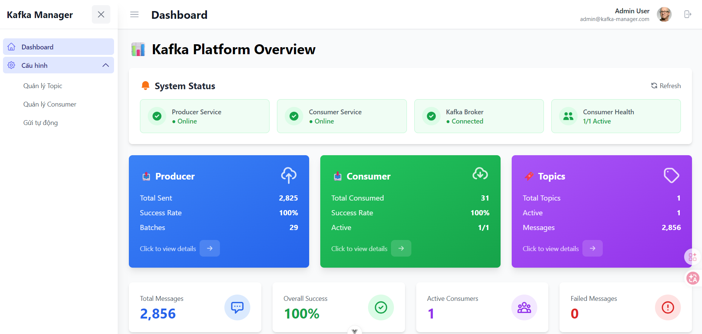
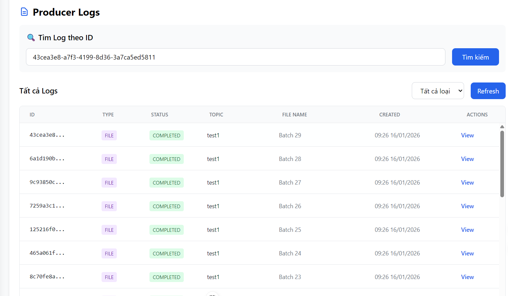
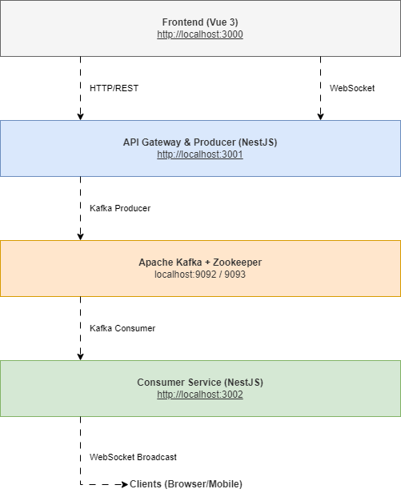

# 🚀 Realtime Data Platform

> Hệ thống xử lý và truyền tải dữ liệu thời gian thực sử dụng Apache Kafka, WebSocket và Vue.js


---

## 📺 Demo

### Screenshots
| Dashboard | Debug Console |
|-----------|---------|
|  |  |

---

## ✨ Features

### 🎯 Core Features
- ✅ **Real-time Data Streaming**: Truyền tải dữ liệu thời gian thực qua Kafka & WebSocket
- ✅ **Producer Management**: Gửi message đến Kafka topics với nhiều định dạng (JSON, File, Batch)
- ✅ **Consumer Management**: Quản lý consumer groups, pause/resume, tìm kiếm message
- ✅ **Topic Management**: Tạo, xóa, cấu hình Kafka topics
- ✅ **WebSocket Broadcasting**: Push notifications real-time đến client
- ✅ **Debug Console**: Xem logs và monitor system health

### 🔧 Advanced Features
- 📊 **Dashboard Analytics**: Thống kê message count, consumer status
- 🔍 **Search & Pagination**: Tìm kiếm message với phân trang
- 📝 **Auto-send Scheduler**: Tự động gửi message theo lịch
- 🎨 **Responsive UI**: Giao diện đẹp, tương thích mobile
- 🐳 **Docker Support**: Deploy dễ dàng với Docker Compose
- ☁️ **AWS Ready**: Hướng dẫn deploy lên AWS EC2

---

## 🛠️ Tech Stack

### Backend
- **Framework**: NestJS (Node.js)
- **Message Broker**: Apache Kafka + Zookeeper
- **Real-time**: Socket.io (WebSocket)
- **Database**: PostgreSQL (optional - for logs)
- **API**: RESTful + WebSocket

### Frontend
- **Framework**: Vue 3 + Vite
- **UI Library**: Tailwind CSS
- **State Management**: Pinia
- **HTTP Client**: Axios
- **WebSocket Client**: Socket.io-client

### DevOps
- **Containerization**: Docker + Docker Compose
- **Reverse Proxy**: Nginx
- **CI/CD**: Ready for AWS EC2 deployment

---

## 🏗️ System Architecture

<div align="center">
  
</div>

### Flow hoạt động:
1. **Frontend** gửi request tạo message → **API Gateway**
2. **API Gateway** push message → **Kafka Topic**
3. **Consumer Service** subscribe và nhận message từ Kafka
4. **Consumer Service** broadcast qua **WebSocket** → Frontend nhận real-time

---

## 📁 Project Structure

```
realtime-data-platform/
│
├── 📂 backend/
│   ├── 📂 api-gateway-producer/       # NestJS Producer & API Gateway
│   │   ├── src/
│   │   │   ├── main.ts
│   │   │   ├── app.module.ts
│   │   │   ├── admin/                 # Admin CRUD endpoints
│   │   │   ├── kafka/                 # Kafka producer module
│   │   │   └── producers/             # Producer controllers
│   │   ├── Dockerfile
│   │   └── package.json
│   │
│   └── 📂 consumer-service/           # NestJS Consumer & WebSocket
│       ├── src/
│       │   ├── main.ts
│       │   ├── app.module.ts
│       │   └── consumers/             # Kafka consumers
│       ├── Dockerfile
│       └── package.json
│
├── 📂 frontend/                       # Vue 3 + Vite
│   ├── src/
│   │   ├── views/                     # Dashboard, Topic, Consumer views
│   │   ├── components/                # Reusable components
│   │   ├── services/                  # API & WebSocket services
│   │   ├── stores/                    # Pinia stores
│   │   └── router/                    # Vue Router
│   ├── Dockerfile
│   └── package.json
│
├── 📂 documents/                      # Tài liệu hướng dẫn
│   ├── CONSUMER_API.md
│   ├── WEBSOCKET_REALTIME_GUIDE.md
│   └── AWS_DEPLOYMENT_GUIDE.md
│
├── 📄 docker-compose.yml              # Dev environment
├── 📄 docker-compose.prod.yml         # Production environment
├── 📄 nginx.conf                      # Nginx reverse proxy config
└── 📄 README.md
```

---

## 🚀 Installation & Setup

### Yêu cầu hệ thống
- **Node.js**: >= 16.x
- **Docker**: >= 20.x
- **Docker Compose**: >= 2.x
- **npm** hoặc **yarn**

### 1️⃣ Clone Repository

```bash
git clone https://github.com/yourusername/realtime-data-platform.git
cd realtime-data-platform
```

### 2️⃣ Chạy với Docker (Khuyến nghị)

#### Development Mode
```bash
docker-compose up --build
```

#### Production Mode
```bash
docker-compose -f docker-compose.prod.yml up -d --build
```

**Services:**
- Frontend: http://localhost:3000
- API Gateway: http://localhost:3001
- Consumer Service: http://localhost:3002
- Kafka: localhost:9092

### 3️⃣ Chạy Local (Không Docker)

#### Backend - API Gateway
```bash
cd backend/api-gateway-producer
npm install
npm run start:dev
```

#### Backend - Consumer Service
```bash
cd backend/consumer-service
npm install
npm run start:dev
```

#### Frontend
```bash
cd frontend
npm install
npm run dev
```

> ⚠️ **Lưu ý**: Cần có Kafka running trước khi chạy backend services

### 4️⃣ Deploy lên AWS EC2

```bash
# Chạy script tự động
bash setup-aws-ec2.sh

# Kiểm tra cấu hình
bash check-config.sh
```

📚 **Chi tiết**: Xem [AWS_DEPLOYMENT_GUIDE.md](./AWS_DEPLOYMENT_GUIDE.md)

---

## 🗄️ Database Schema

### PostgreSQL (Optional - for logging)

```sql
-- Topic Configuration
CREATE TABLE topics (
  id SERIAL PRIMARY KEY,
  name VARCHAR(255) NOT NULL UNIQUE,
  partitions INT DEFAULT 1,
  replication_factor INT DEFAULT 1,
  created_at TIMESTAMP DEFAULT NOW()
);

-- Consumer Groups
CREATE TABLE consumer_groups (
  id SERIAL PRIMARY KEY,
  group_id VARCHAR(255) NOT NULL UNIQUE,
  topic_name VARCHAR(255) NOT NULL,
  status VARCHAR(50),
  created_at TIMESTAMP DEFAULT NOW()
);

-- Message Logs (optional)
CREATE TABLE message_logs (
  id SERIAL PRIMARY KEY,
  topic_name VARCHAR(255),
  message_key VARCHAR(255),
  message_value TEXT,
  timestamp TIMESTAMP DEFAULT NOW()
);
```

> 💡 Database là optional, hệ thống hoạt động hoàn toàn với Kafka

---

## 📡 API Endpoints

### 🔹 Producer API (Port 3001)

#### Send Message
```http
POST /api/producer/send
Content-Type: application/json

{
  "topic": "test-topic",
  "message": {
    "key": "user-123",
    "value": "Hello Kafka"
  }
}
```

#### Send Batch Messages
```http
POST /api/producer/send-batch
Content-Type: application/json

{
  "topic": "test-topic",
  "messages": [
    {"key": "1", "value": "Message 1"},
    {"key": "2", "value": "Message 2"}
  ]
}
```

#### Upload File
```http
POST /api/producer/upload
Content-Type: multipart/form-data

file: [binary]
topic: "file-topic"
```

### 🔹 Consumer API (Port 3002)

#### Get Consumers
```http
GET /api/consumers
```

#### Pause Consumer
```http
POST /api/consumers/:id/pause
```

#### Resume Consumer
```http
POST /api/consumers/:id/resume
```

#### Search Messages
```http
GET /api/consumers/search?topic=test-topic&keyword=hello&page=1&limit=10
```

### 🔹 Topic API (Port 3001)

#### List Topics
```http
GET /api/kafka/topics
```

#### Create Topic
```http
POST /api/kafka/topics
Content-Type: application/json

{
  "name": "new-topic",
  "partitions": 3,
  "replicationFactor": 1
}
```

#### Delete Topic
```http
DELETE /api/kafka/topics/:topicName
```

### 🔹 WebSocket Events (Port 3002)

```javascript
// Client-side connection
import io from 'socket.io-client';

const socket = io('http://localhost:3002');

// Subscribe to topic
socket.emit('subscribe', { topic: 'test-topic' });

// Listen for messages
socket.on('message', (data) => {
  console.log('New message:', data);
});

// Listen for consumer status
socket.on('consumer-status', (status) => {
  console.log('Consumer status:', status);
});
```

📚 **Chi tiết**: Xem [CONSUMER_API.md](./documents/CONSUMER_API.md)

---

## 👨‍💻 Author

**Võ Trung Nhân**

- 📧 Email: [nhantrung297@gmail.com](mailto:nhantrung297@gmail.com)
- 💼 LinkedIn: [https://www.linkedin.com/in/vtn2907/](https://www.linkedin.com/in/vtn2907/)
- 🐙 GitHub: [@VTNMT2930](https://github.com/VTNMT2930)
- 🌐 Portfolio: [https://nhanit.io.vn/](https://nhanit.io.vn/)

---

## 📚 Tài liệu tham khảo

- [CONSUMER_API.md](./documents/CONSUMER_API.md) - API cho consumers
- [WEBSOCKET_REALTIME_GUIDE.md](./documents/WEBSOCKET_REALTIME_GUIDE.md) - Hướng dẫn WebSocket
- [CONSUMER_SEARCH_PAGINATION_GUIDE.md](./documents/CONSUMER_SEARCH_PAGINATION_GUIDE.md) - Tìm kiếm & phân trang
- [TOPIC_MANAGEMENT_FEATURES.md](./documents/TOPIC_MANAGEMENT_FEATURES.md) - Quản lý Kafka topics
- [AWS_DEPLOYMENT_GUIDE.md](./AWS_DEPLOYMENT_GUIDE.md) - Deploy lên AWS EC2

---

<div align="center">
  
**⭐ Nếu project hữu ích, đừng quên cho một Star! ⭐**

Made with ❤️ by Nguyễn Văn Nhân

</div>
